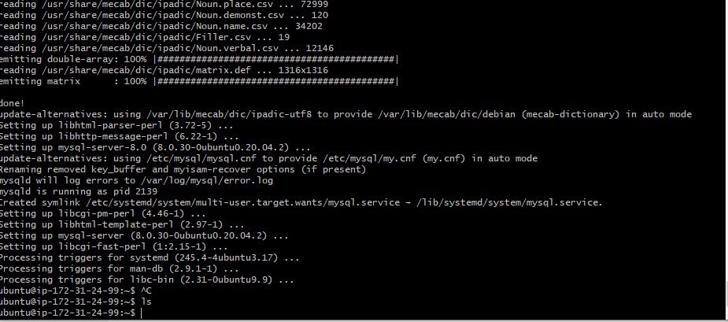
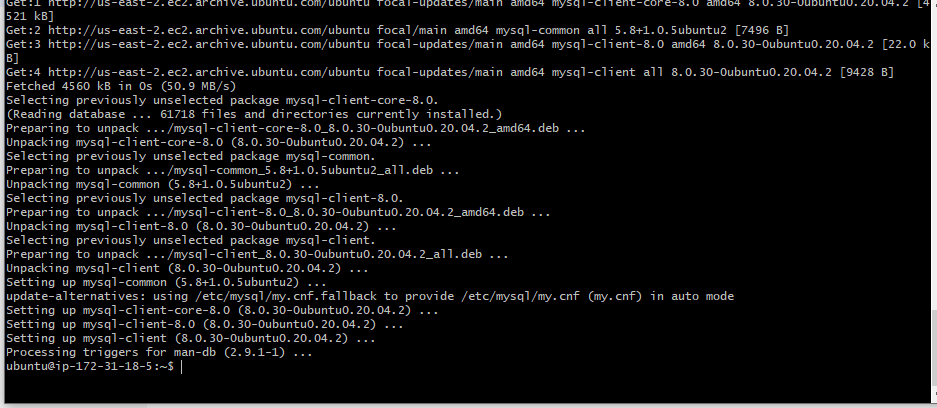
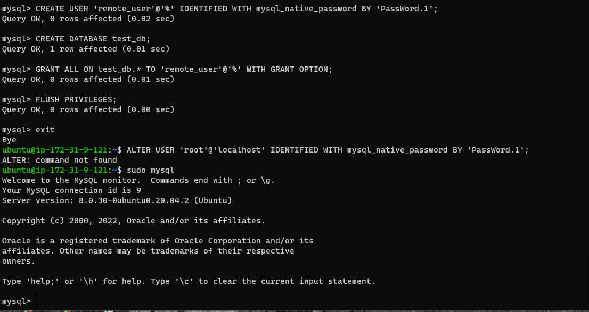
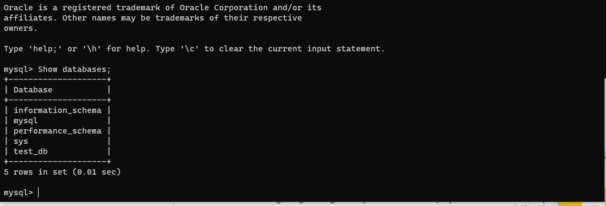
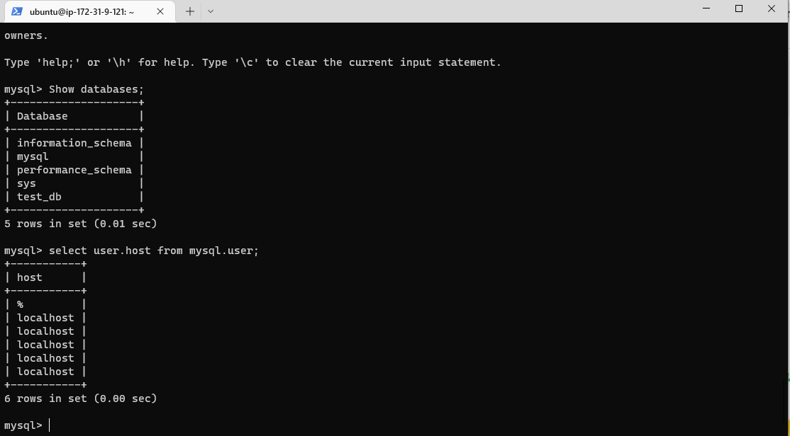

**CLIENT-SERVER ARCHITECTURE WITH MYSQL**

**IMPLEMENT A CLIENT SERVER ARCHITECTURE USING MYSQL DATABASE MANAGEMENT SYSTEM (DBMS).**

**On mysql server Linux Server install MySQL Server software**

**installing with the commands below**

**sudo apt update -y**

**sudo apt install mysql-server -y**

****

**installing msql to client server**

****

****

**To show the systems are communicating**

**Show databases;**

****

**select user host from mysql**

****

